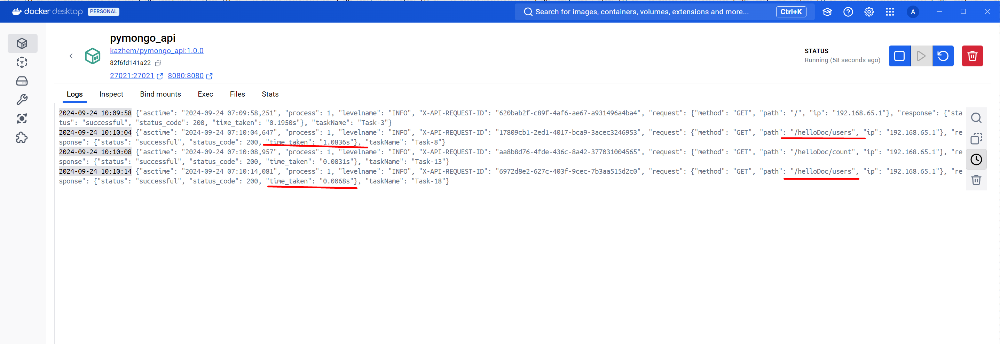

# pymongo-api  | sharding_repl_cache

## Как запустить

Запускаем mongodb и приложение

```shell
docker compose up -d
```

Инициализируемся и заполняем БД данными:

```shell
./scripts/mongo-init.sh
```


## Как проверить на локальной машине

Откройте в браузере http://localhost:8080

Количество документов в Шарде-1:
```shell
./scripts/shard-1.sh
```

Количество документов в Шарде-1-реплика-1:
```shell
./scripts/shard-1-1.sh
```

Количество документов в Шарде-1-реплика-2:
```shell
./scripts/shard-1-2.sh
```

Количество документов в Шарде-2:
```shell
./scripts/shard-2.sh
```

Количество документов в Шарде-2-реплика-1:
```shell
./scripts/shard-2-1.sh
```

Количество документов в Шарде-2-реплика-2:
```shell
./scripts/shard-2-2.sh
```

Статус реплик шард-1:
```shell
./scripts/shard-1-status.sh
```
Статус реплик шард-2:
```shell
./scripts/shard-2-status.sh
```

Скорость вызова эндпоинта:
